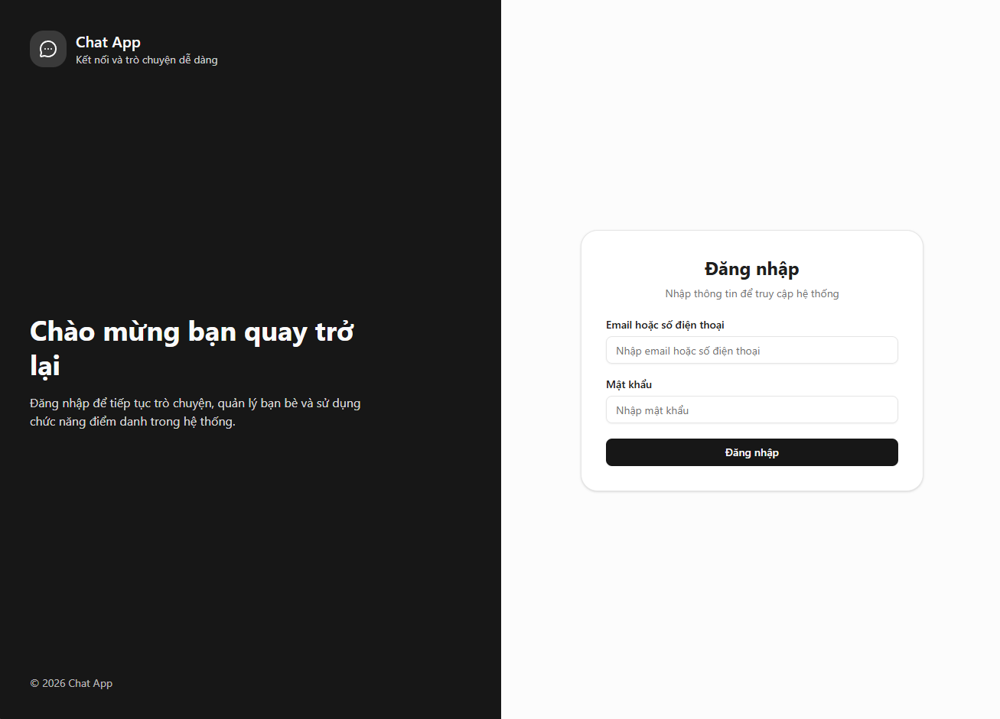
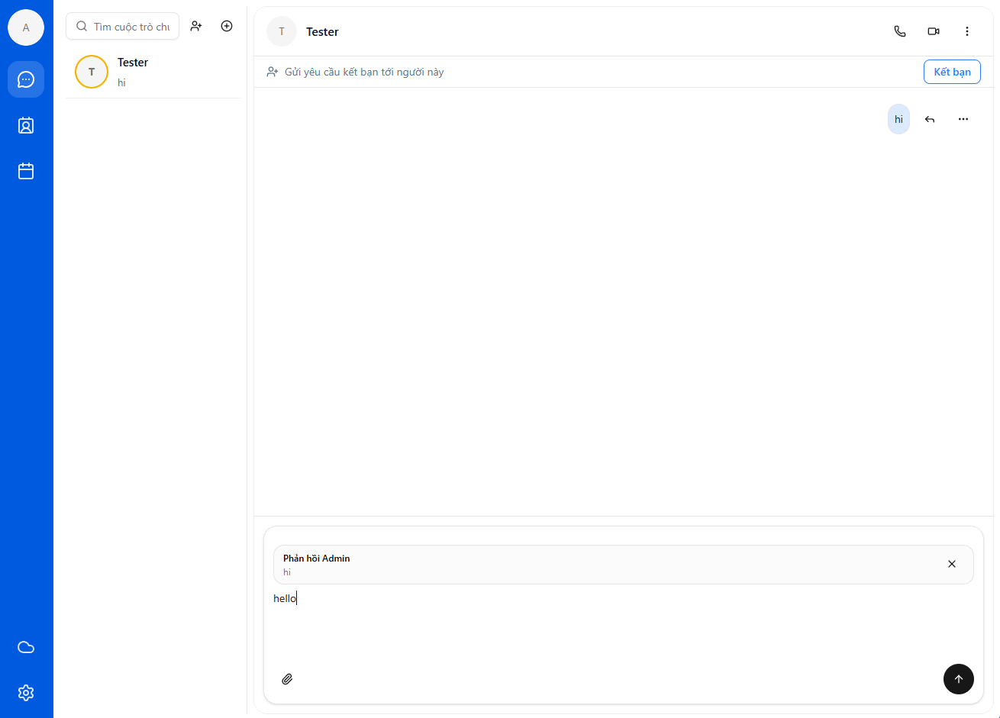
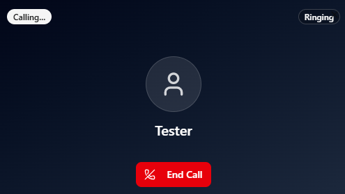
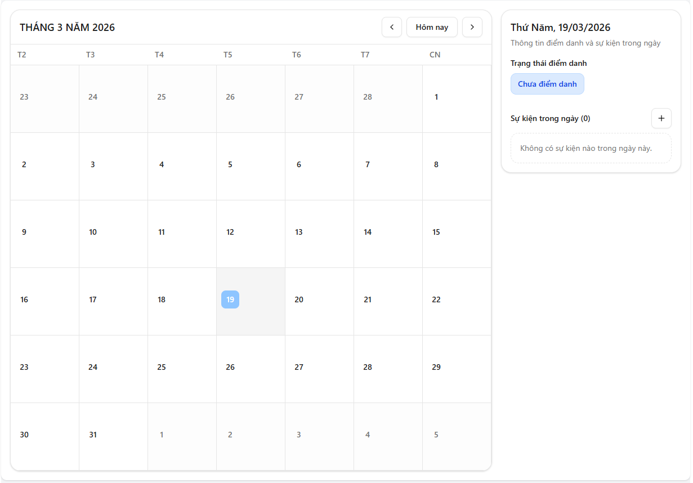

# 🚀 Chat React App

A modern real-time chat application built with **React**, delivering a smooth, fast, and interactive messaging experience. This project is designed with scalability in mind and integrates seamlessly with a backend API system.


---

## 🔗 Backend API

This frontend connects to the backend service:

👉 **Spring Boot Backend API:**
https://github.com/tongducduy309/Chat_API

👉 **Face Recognition Service (FastAPI):**
https://github.com/tongducduy309/Face-Service-ChatApp

---

## 📌 Features

* 🔐 Authentication (Login / Register with JWT)
* 💬 Real-time chat (1-1 messaging)
* 👥 Friend management system

  * Send / Accept / Reject friend requests
  * Block / Unblock users
* 🔔 Notification system
* 📅 Event / calendar feature
* 📷 Face recognition integration
* 🧑‍💻 Responsive UI (mobile & desktop)
* ⚡ Optimized rendering (React hooks, memoization)

---

## 🛠️ Tech Stack

### Frontend

* ⚛️ React
* ⚡ Vite
* 🎨 TailwindCSS
* 🧩 Ant Design
* 🔄 Axios
* 🧭 React Router
* 🧠 Custom Hooks

### Backend

* ☕ Spring Boot (Main API)
* 🧠 FastAPI (Face Recognition)
* 🔐 JWT Authentication
* 🗄️ MySQL / PostgreSQL

---

## 📂 Project Structure

```bash
src/
│── components/      # Reusable UI components
│── pages/           # Main pages (Chat, Login, Register,...)
│── services/        # API calls
│── hooks/           # Custom React hooks
│── utils/           # Helper functions
│── assets/          # Images, icons
│── styles/          # Global styles
│── App.tsx
│── main.tsx
```

---

## ⚙️ Installation

### 1. Clone repository

```bash
git clone https://github.com/tongducduy309/Chat-React.git
cd Chat-React
```

### 2. Install dependencies

```bash
npm install
```

or

```bash
yarn install
```

### 3. Setup environment variables

Create `.env` file in root:

```env
VITE_API_URL=http://localhost:8080/api
VITE_FACE_API_URL=http://localhost:8000
```

### 4. Run project

```bash
npm run dev
```

---

## 🔄 API Integration

The application communicates with backend services via REST APIs:

* Auth API (login/register)
* Chat API (messages)
* Friendship API
* Event API
* Face Recognition API

Example:

```ts
const response = await axios.get(`${import.meta.env.VITE_API_URL}/users`);
```

---

## 📸 Screenshots

### Login Page

<p align="center">
  
</p>


### Chat UI
<p align="center">
  
</p>

### Call UI
<p align="center">
  
</p>

### Calendar Page
<p align="center">
  
</p>

---

## 🚧 Future Improvements

* 📹 Video / voice call (WebRTC)
* 🧠 AI chatbot integration
* 🌍 Multi-language (i18n)
* 📱 Mobile app (React Native)
* 📡 WebSocket real-time chat (Socket.IO)


---

## 👨‍💻 Author

**Tong Duc Duy**

* GitHub: https://github.com/tongducduy309

---

